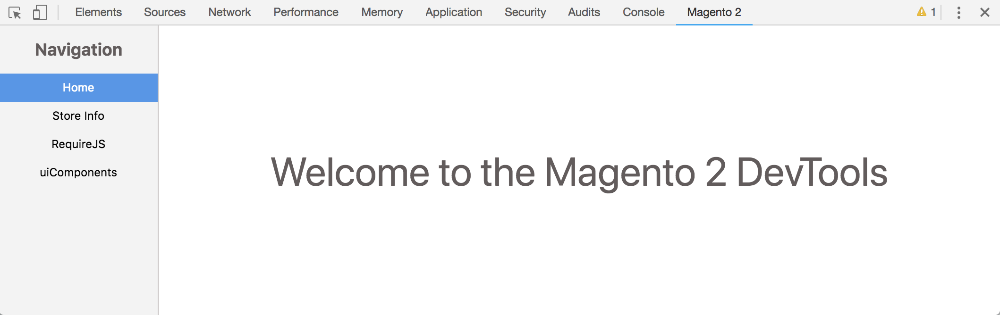

# Magento 2 DevTools

An extension for Google Chrome (and [likely Mozilla Firefox](https://developer.mozilla.org/en-US/docs/Mozilla/Add-ons/WebExtensions)) that exposes helpful debugging utilities for Magento 2 front-ends.

## Early Release

This is a very new project with little to no documentation, published to solicit feedback from early adopters. The extension is currently only available through manual installation of the development build, and will be published to the Chrome Web Store at a future time.

[**Documentation**](docs/README.md)

## Usage

Whenever you navigate to a page running Magento 2, a new tab should appear in DevTools from this extension.

## In-Progress Features

-   [RequireJS Optimizer](https://requirejs.org/docs/optimization.html) configuration generator (including Magento module for quick install)
-   RequireJS module registry inspector

## Possible Future Features

-   uiComponents Explorer/Inspector (think React/Angular DevTools)
-   m2 Front-End best-practices checks

## Running Development Build (Google Chrome)

### Prerequisites

-   `node.js` >= `8.x`
-   `npm` >= `6.x`

### Setup

1. Clone the repository
2. Run `npm install`
3. Run `npm start`
4. Navigate to `chrome://extensions`
5. Enable `Developer mode`
6. Click `Load unpacked`
7. Select the `extension` folder in the root of this repository

### Notes

-   To run a single build, use `npm run build` instead of `npm start`
-   If you have Chrome DevTools open when you make a change in `src`, you'll need to close and re-open DevTools to see the changes
-   If you need to debug the DevTools page (React app in `src`), open the `Magento 2` tab in DevTools, then right click + `Inspect Element`. This will open a new instance of the DevTools pointed at the React application.
