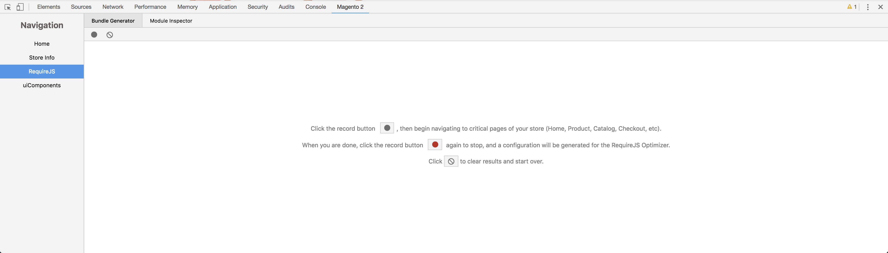
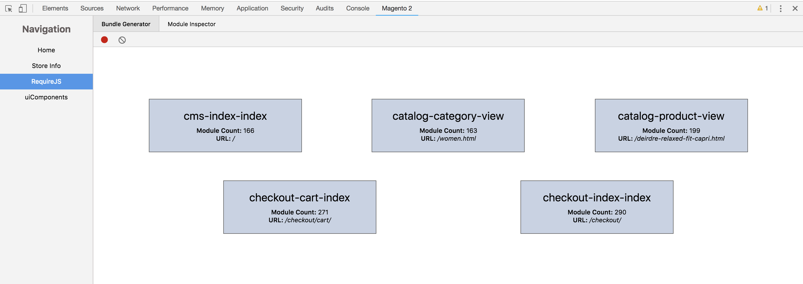
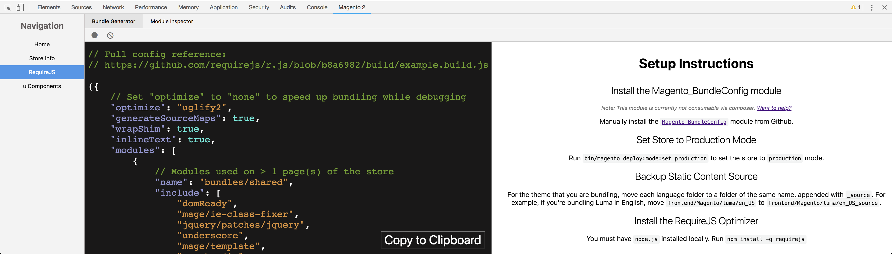

# RequireJS

The RequireJS tab of this extension includes useful tools to work with JavaScript modules within a Magento 2 store.

## Bundle Generator

The `Bundle Generator` panel can be used to generate a configuration file for the [`RequireJS Optimizer`](https://requirejs.org/docs/optimization.html), helping you to bundle your store as efficiently as possible.

Due to some patterns used within the Magento 2 front-end, it is not possible to create optimized bundles purely through static analysis. Instead, this tool will record real usage metrics across various pages of your store, and then generate optimized bundle based on that data.

### Usage

1. Visit any page in the storefront in a browser with this extension installed
2. Open `RequireJS` >> `Bundle Generator`
3. Click the Record button
4. Begin navigating to critical pages of your store (Home/Catalog/Product/Cart/Checkout)
5. Click the Record button again when you are finished
6. Follow the installation instructions in the `Bundle Generator` UI

### Screenshots

